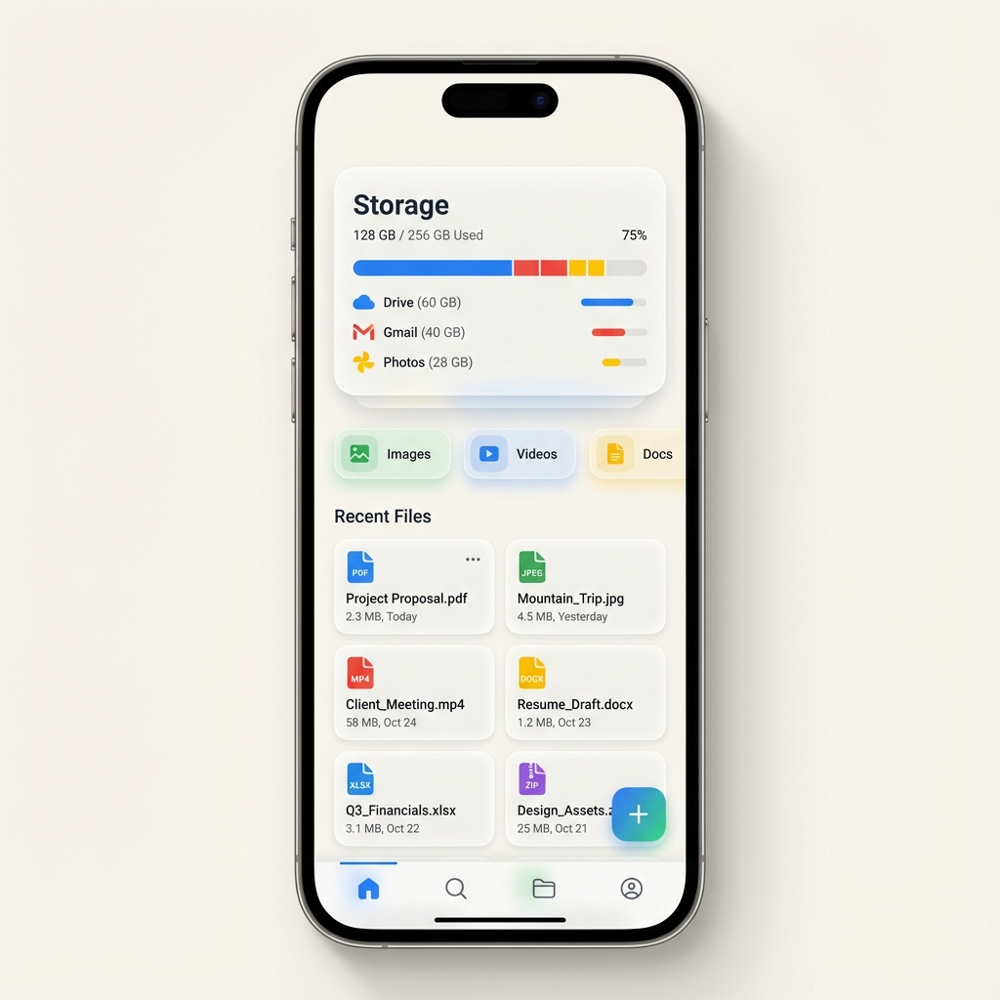

# Carbide

Carbide is a premium mobile experience that combines the best of **Google Storage** and **Google Drive**. It provides a sleek, modern interface for managing your files, monitoring storage, and collaborating with others.



## Features

-   **Intelligent Storage Dashboard**: Real-time visualization of your storage usage across Drive, Gmail, and Photos.
-   **Full CRUD Support**: Seamlessly create, rename, and delete files and folders with native iOS/macOS gestures.
-   **Smart Categorization**: Quick-access filters for Images, Videos, Documents, and Audio.
-   **Persistence with SwiftData**: All your changes are saved instantly and synced across the app.
-   **Premium Aesthetics**: Curated Google-inspired color palettes, glassmorphism, and smooth animations.

## Tech Stack

-   **SwiftUI**: For a modern, declarative UI.
-   **SwiftData**: Next-generation data persistence and modeling.
-   **Google Design Principles**: Clean, vibrant, and user-centric aesthetics.

## Prerequisites

- **Xcode 15.0+** (for SwiftUI and SwiftData support)
- **macOS 13.0+** or **iOS 17.0+**
- Swift 5.9+

## Getting Started

1.  Clone the repository:
    ```bash
    git clone <repository-url>
    cd Carbide
    ```

2.  Open `Carbide.xcodeproj` in Xcode.

3.  Select your target device (iOS Simulator or Mac) from the scheme selector.

4.  Build and run the project (⌘R).

5.  The app will automatically seed itself with demo data on first launch!

## Development

This project uses standard Xcode project structure. User-specific files and build artifacts are excluded via `.gitignore`.

### Project Structure

- `Carbide/` - Main application source code
  - SwiftUI views and components
  - SwiftData models and persistence
  - Storage management utilities
- `CarbideTests/` - Unit tests
- `CarbideUITests/` - UI tests

---
Built with ❤️ for a better file management experience.
